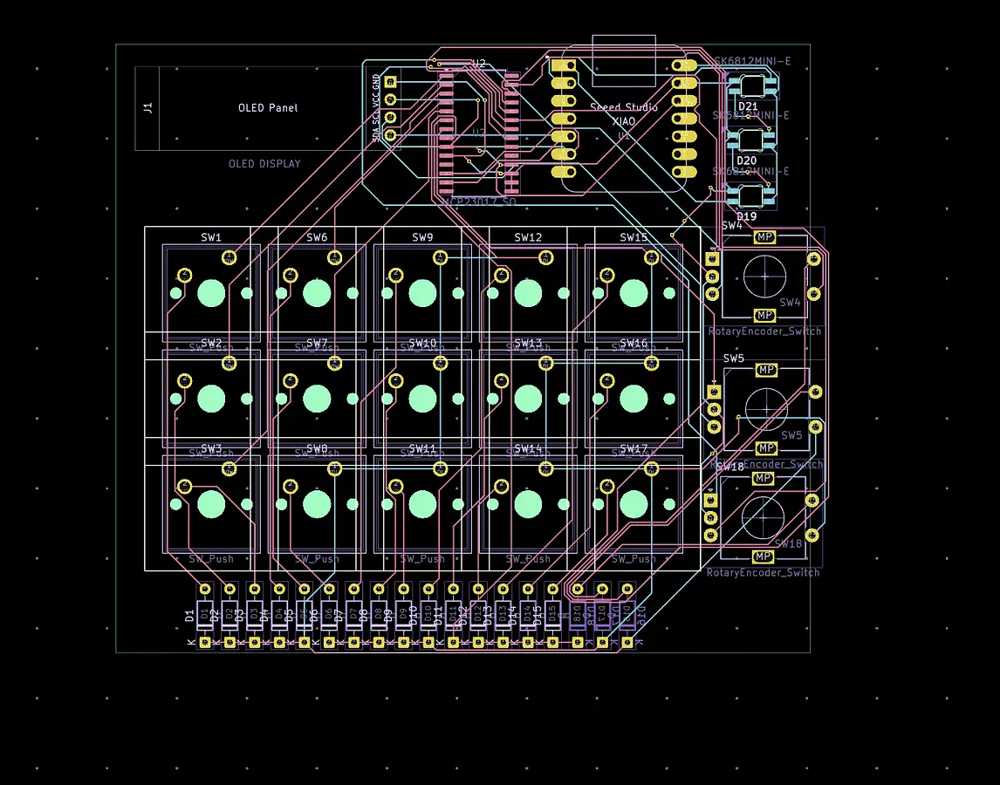

# hackpad
my hackpad that i can use for various controls

## Features
- 15 buttons in a 3x5 matrix
- 3 rotary encoders for controls like volume and numeric input
- an oled screen to show preset in action and other details
- 3 status leds
- maybe games on the device itself?
